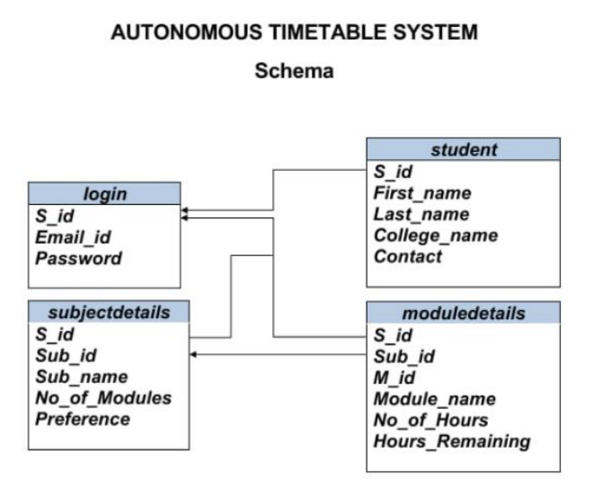
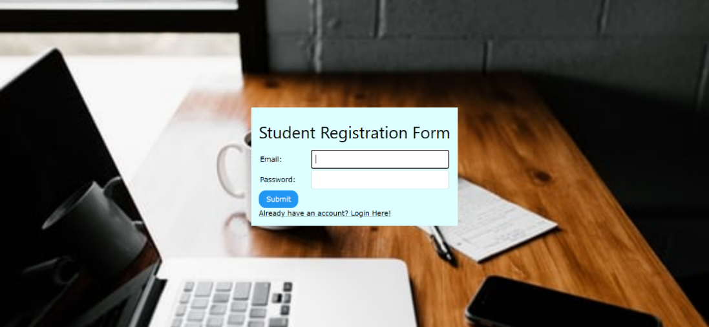
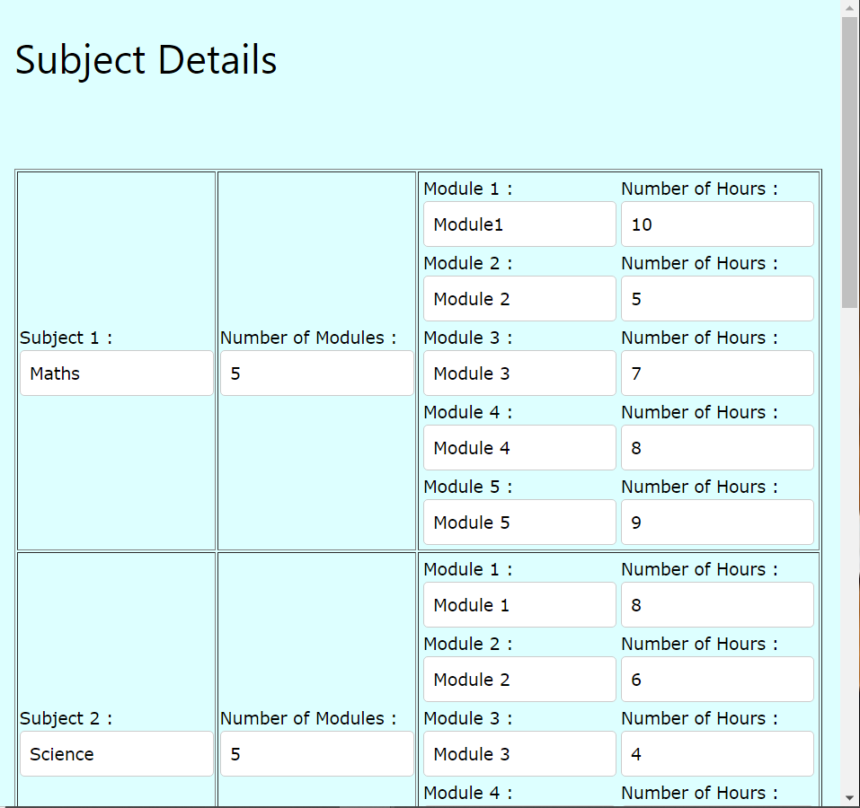
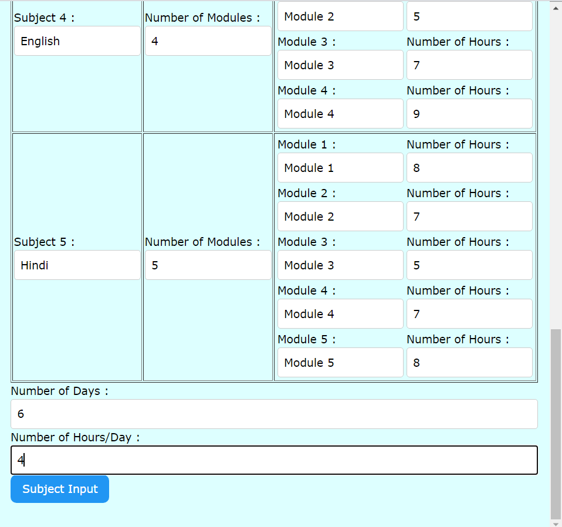

# Autonomous-Timetable-System-for-Study-Timetable
This system will allow a student to schedule a study timetable autonomously by providing the subject details

## Architecture of System

## Database Schema

## Images of System

## Thanks to the following people
<a href="https://github.com/Yashaswini2110">Yashaswini Chaudhari</a> 
<a href="https://github.com/github36shah">Srushti Shah</a>

### References:
<a href="https://github.com/pranavkhurana/Time-table-scheduler">Pranav Khurana (Timetable Scheduler) </a>
